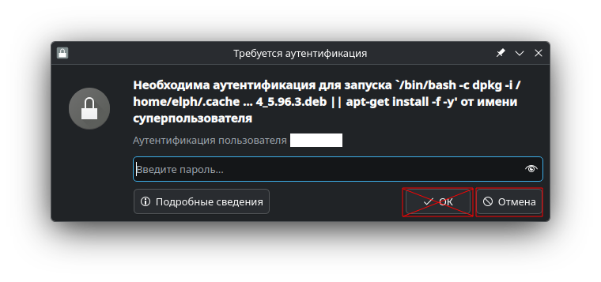
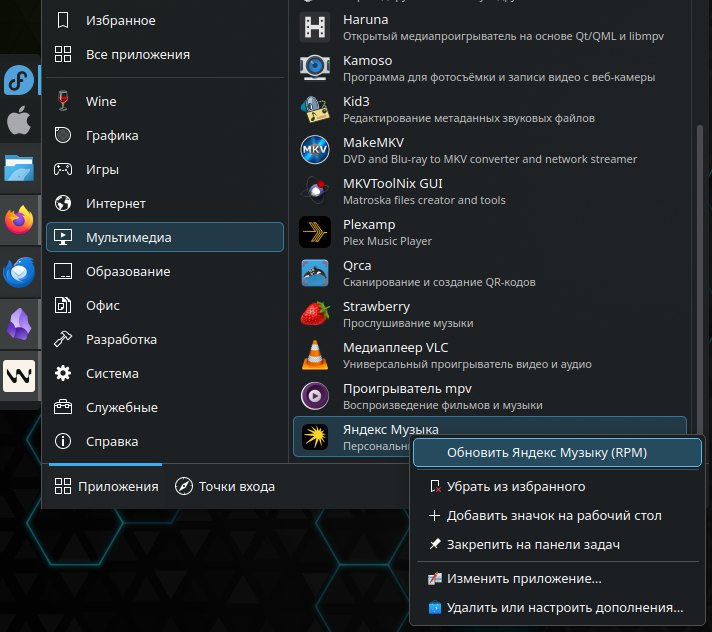
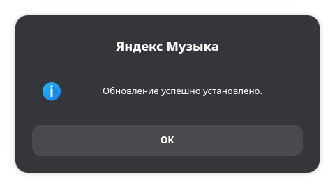

# Yandex Music RPM Workaround for Fedora/openSUSE

This repository contains a tool for adapting the official Yandex Music `.deb` package to RPM-based distributions (Fedora, openSUSE).

## Build Features

- **Hi-Res Audio:** Stable operation confirmed up to **176.4 KHz** via ALSA.
- **Bluetooth:** Optimized for LDAC codec (tested on Sony WH-XB900N, 88.2 KHz).
- **Package Name:** Alien automatically increments the package version for correct package manager behavior. You'll see "Beta" where the app shows the build number.
- **Integration:** Menu categories fixed (now shown under "Music") and taskbar icon display fixed (StartupWMClass). These changes are only in the app launcher. The source code is not modified.
- **Updates:** A "Update Yandex Music (RPM)" context-menu action is added to the launcher, and the updater scripts are shipped inside the RPM package itself. Both a command-line and a graphical flow are supported — the latter with a standard privilege prompt, a progress indicator, and a final result dialog.

## Updating the Application

Do not use the built-in in-app update flow: it targets `.deb` packages and only breaks the install on RPM systems. If the app offers to update itself — decline.

If a superuser password prompt pops up when you close the app — decline that too.

Use the extra launcher context-menu item instead: "Update Yandex Music (RPM)". It is available from your desktop shell's application menu (GNOME Activities, KDE Application Launcher, etc.) by right-clicking the "Yandex Music" icon.

Enter your password in the standard system privilege dialog and wait for the result window.

Ways to trigger an update:

1. The launcher context-menu item "Update Yandex Music (RPM)" — the graphical flow with progress indicator and result dialog (requires `zenity` or `kdialog`).
2. The `yandexmusic-rpm-update` command in a terminal — same flow; if `zenity`/`kdialog` are available, the graphical mode is used, otherwise a text-only mode.
3. `./install_rpm.sh` from this repository, for debugging or manual control.
4. `./build_rpm.sh` followed by installing the resulting RPM with your system's package tools, when you only need to build without installing.

`yandexmusic-rpm-update` is a thin wrapper around `/opt/Яндекс Музыка/updater/gui_wrapper.sh`, which picks the available GUI toolkit and requests privilege elevation via `pkexec`. It then invokes `/opt/Яндекс Музыка/updater/install_rpm.sh`, which rebuilds the RPM from the latest `.deb` in a temporary directory and installs it.

## How to Use

1. Clone the repository.
2. Install dependencies: `sudo dnf install alien curl desktop-file-utils`. Additionally, for the graphical update flow it is recommended to install `zenity` (GTK) or `kdialog` (KDE).
3. Build the RPM as a regular user: `./build_rpm.sh`.
4. Install the resulting RPM with your system's regular package tools, or use `./install_rpm.sh` if you want a guided install/check flow.

`build_rpm.sh` is a simple builder. It only downloads the `.deb`, patches the launcher in the Alien build tree, and builds the RPM. It does not require `sudo`. The resulting RPM can be installed with your system's standard package management tools.

`install_rpm.sh` is only needed if you want more control over the installation or debugging flow. It handles the privileged part: it looks for a ready RPM in the project directory, runs `./build_rpm.sh` if needed, installs the package, updates the desktop database, and verifies that the package and desktop file are present.

## Why Not a Prebuilt RPM?

To avoid violating the rights of the license holder, the binary in this repository is included only as an example of a successful script run.

The scripts only automate the conversion of the official package provided by Yandex for your local system.

No changes are made to the application source code; only repackaging is performed using the alien tool, including fixing the launcher inside the generated RPM build tree before the package is built.
